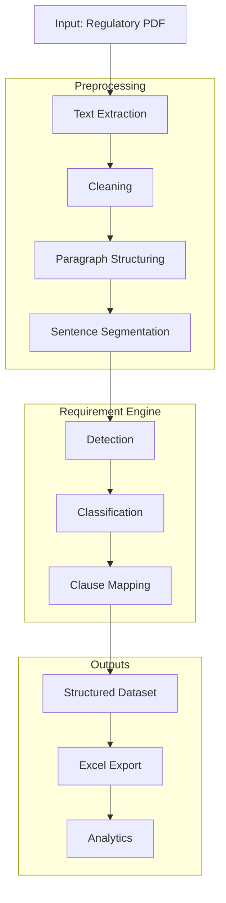

Suggested repo name - Requirements-Extraction-Engine

[Requirements Engineering Toolkit] Rule-based pipeline for extracting and structuring requirements from safety-critical regulatory documents to support traceability and systems engineering analysis.

⭐ **1. Introduction**

Safety-critical automotive and aerospace systems rely on requirements management tools such as IBM DOORS, Jama Connect, and Polarion to ensure traceability, validation, and compliance across the system lifecycle. These tools depend on structured requirements derived from regulatory documents and standards.

This project provides an automated pipeline that extracts and structures requirements from regulatory text, generating a format suitable for downstream use in requirements management and traceability workflows.

<table>
  <tr>
    <td align="center">
      <b></b> 
      
    </td>
  </tr>
</table>

---
🧩 **2. Challenge**

Manually reviewing regulatory documents to identify and extract requirements is highly time-consuming and effort-intensive. These documents are large, dense, and written in complex legal language, requiring careful interpretation to separate normative requirements from descriptive text.

Key challenges include:
- High manual effort required for screening large regulatory documents
- Time-consuming identification and extraction of normative requirements
- Inconsistencies in interpretation during manual structuring
- Difficulty in maintaining scalable and repeatable requirements traceability processes

---
🎯 **3. Objectives**

This project aims to automate the early-stage processing of regulatory documents into structured requirements suitable for use in requirements management tools such as IBM DOORS and Polarion.

Key objectives include:
- Automatically extract normative requirements from unstructured regulatory text
- Preserve regulatory structure by distinguishing MAIN and ANNEX sections
- Maintain clause-level traceability for requirements referencing
- Classify requirements into functional categories for systems engineering use
- Structure outputs for integration into requirements management workflows

---

🛠 **4. Tech Stack**

This project uses rule-based Natural Language Processing (NLP) techniques to extract and structure requirements from regulatory documents.

Key technologies include:
- Python – core implementation of the requirements extraction pipeline
- pdfplumber – extraction of raw text from regulatory PDF documents
- re (Regular Expressions) – clause detection, sentence segmentation, and rule-based pattern matching
- Pandas – structured representation and analysis of extracted requirements
- OpenPyXL – export of structured outputs into Excel for traceability and review
- Matplotlib – basic analytics and distribution visualization of requirements

---

🧠 **5. System Architecture**

